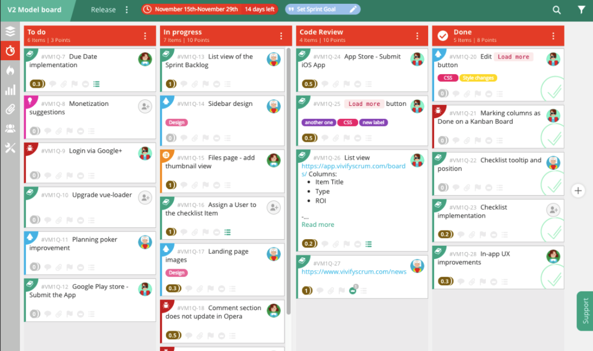

# agile-mdx
Agile presentation using MDX deck

---

## Agile software development

---

## Concept

Agile software development describes an approach to **software development** under which requirements and solutions evolve through the collaborative effort of **self-organizing** and **cross-functional** teams and their **customer(s)/end user(s)**.

It advocates adaptive planning, evolutionary development, early delivery, and continual improvement, and it encourages rapid and flexible response to change.

---

## Overview

- Iterative, incremental and evolutionary
- Efficient and face-to-face communication
- Very short feedback loop and adaptation cycle
- Quality focus

---

## Philosophy

- Adaptive vs Predictive
- Iterative vs Waterfall
- Code vs Documentation

---

## The Manifesto

- **Individuals and Interactions** over processes and tools
- **Working Software** over comprehensive documentation
- **Customer Collaboration** over contract negotiation
- **Responding to Change** over following a plan

---

## Principles

1. Customer satisfaction by early and continuous delivery of valuable software
2. Welcome changing requirements, even in late development
3. Working software is delivered frequently (weeks rather than months)
4. Close, daily cooperation between business people and developers
5. Projects are built around motivated individuals, who should be trusted
6. Face-to-face conversation is the best form of communication (co-location)
7. Working software is the primary measure of progress
8. Sustainable development, able to maintain a constant pace
9. Continuous attention to technical excellence and good design
10. Simplicity — the art of maximizing the amount of work not done — is essential
11. Best architectures, requirements, and designs emerge from self-organizing teams
12. Regularly, the team reflects on how to become more effective, and adjusts accordingly

---

## Agile software development methods

- Adaptive software development (ASD)
- Agile modeling
- Agile unified process (AUP)
- Disciplined agile delivery
- Dynamic systems development method (DSDM)
- **Extreme programming (XP)**
- Feature-driven development (FDD)
- Lean software development
- **Kanban**
- Rapid application development (RAD)
- **Scrum**
- Scrumban

---

## Scrum

Scrum is an **iterative** and **incremental** framework for managing product development.

Scrum adopts an evidence-based empirical approach—accepting that the problem cannot be fully understood or defined up front, and instead focusing on how to maximize the team's ability to deliver quickly, to respond to emerging requirements, and to adapt to evolving technologies and changes in market conditions.

---

---

## Roles

### Product owner
The Product Owner is expected to do the best possible job of satisfying all stakeholders, maintain the Product Backlog, and ensure that everyone knows the priorities.

### Scrum master
The Scrum Master helps the Scrum Team perform at their highest level. They also **protect the team from both internal and external distractions**.

### Development team
Development Teams are structured and empowered to organize and manage their own work. The resulting synergy optimizes overall efficiency and effectiveness.

---

## Sprint

A sprint (or iteration) is the basic unit of development in Scrum. The sprint is a timeboxed effort; that is, it is **restricted to a specific duration**. The duration is fixed in advance for each sprint and is normally **between one week and one month**, with two weeks being the most common.

---

## Sprint planning

- Mutually discuss and agree on the scope of work that is intended to be done during that sprint
- Select **product backlog** items that can be completed in one sprint
- Prepare a **sprint backlog** that includes the work needed to complete the selected product backlog items
- The recommended duration is **four hours** for a **two-week** sprint
- Once the development team has prepared their sprint backlog, they forecast (usually by **voting**) which tasks will be delivered within the sprint.

---

## Backlog

---

## User story

A user story is a tool used in Agile software development to capture a description of a software feature from an end-user perspective. The user story describes the **type of user**, **what they want** and **why**. A user story helps to create a simplified description of a requirement.

---

## User story format

As a **ROLE**, I want **FEATURE** so that **REASON**.

### Examples

- As a user, I want to upload photos so that I can share photos with others.
- As an administrator, I want to approve photos before they are posted so that I can make sure they are appropriate.

---

## Story points

A story point is an abstract measure of effort required to implement a user story. In simple terms, it is a number that tells the team about the difficulty level of the story. Difficulty could be related to **complexities**, **risks**, and **efforts involved**.

### Scales for sizing

- 1,2,4,8,16
- X-Small, Small, Medium, Large, Extra-Large ( known as “T-Shirt Sizing”)
- **Fibonacci sequence: 1,2,3,5,8,13,21**

---

## Story points vs. hours

- Dates don’t account for the **non-project related work** that inevitably creeps into our days: emails, meetings, and interviews that a team member may be involved in.
- Dates have an **emotional attachment** to them. Relative estimation removes the emotional attachment.
- Each team will estimate work on a slightly different scale, which means their **velocity** (measured in points) will naturally be different. This, in turn, makes it impossible to play politics using velocity as a weapon.
- Once you agree on the relative effort of each **story point value**, you can assign points quickly without much debate.
- Story points reward team members for solving problems **based on difficulty, not time spent**. This keeps team members **focused on shipping value, not spending time**.

---

## Sprint planning process

- During the first half, the whole scrum team (development team, scrum master, and product owner) selects the product backlog items they believe **could be completed** in that sprint
- During the second half, the development team **identifies the detailed work (tasks)** required to complete those product backlog items; resulting in a confirmed sprint backlog
- As the detailed work is elaborated, some product backlog items may be **split or put back into the product backlog** if the team no longer believes they can complete the required work in a single sprint

---

## Daily Scrum

- Starts **precisely on time** even if some development team members are missing
- Should happen **at the same time and place every day**
- Is limited (timeboxed) to **fifteen minutes**

---

## Stand-up questions

- What did I complete yesterday that contributed to the team meeting our sprint goal?
- What do I plan to complete today to contribute to the team meeting our sprint goal?
- **Do I see any impediment that could prevent me or the team from meeting our sprint goal?**

Any impediment (e.g., stumbling block, risk, issue, delayed dependency, assumption proved unfounded) identified in the daily scrum should be captured by the **scrum master** and displayed on the team's scrum board or on a shared risk board, with an agreed person **designated to working toward a resolution** (outside of the daily scrum). No detailed discussions should happen during the daily scrum.

---

---

## Sprint review

- Reviews the work that was completed and the planned work that was not completed
- Presents the **completed** work to the stakeholders (a.k.a. the demo)
- The team and the stakeholders collaborate on what to work on next

---

## Sprint retrospective

- Reflects on the past sprint
- Identifies and agrees on continuous process improvement actions

### Guidelines

- Two main questions are asked in the sprint retrospective: What went **well** during the sprint? What **could be improved** in the next sprint?
- The recommended duration is **one-and-a-half hours** for a **two-week sprint**
- This event is facilitated by the **scrum master**

---

## Extreme programming (XP)

Extreme programming (XP) is a software development methodology which is intended to improve software quality and responsiveness to changing customer requirements.

---

## Elements

- Short development cycles
- Programming in pairs
- Code review
- Unit testing of all code
- Code simplicity and clarity
- Flat management structure
- Frequent communication with the customer and among programmers
- ...

---

## Idea

The methodology takes its name from the idea that the beneficial elements of traditional software engineering practices are taken to "extreme" levels. As an example, code reviews are considered a beneficial practice; taken to the extreme, code can be reviewed continuously, i.e. the practice of pair programming.

---

## Practices

### Fine-scale feedback

- Pair programming
- Planning game
- Test-driven development
- Extreme programming practices

### Continuous process

- Continuous integration
- Refactoring or design improvement
- Small releases

### Shared understanding

- Coding standards
- Collective code ownership
- Simple design
- System metaphor

---

## Practices

### Programmer welfare

- Sustainable pace

### Coding

- The customer is always available
- Code the unit test first
- Only one pair integrates code at a time
- Leave optimization until last
- No overtime

### Testing

- All code must have unit tests
- All code must pass all unit tests before it can be released.
- When a bug is found, tests are created before the bug is addressed
- Acceptance tests are run often and the results are published

---

## Coding

The advocates of XP argue that **the only truly important product** of the system development process is **code** – software instructions that a computer can interpret. Without code, there is no working product.

Coding can also be used to figure out the most suitable solution. Coding can also help to **communicate thoughts** about programming problems. A programmer dealing with a complex programming problem, or finding it hard to explain the solution to fellow programmers, might code it in a simplified manner and use the code to demonstrate what he or she means. Code, say the proponents of this position, is always **clear and concise** and cannot be interpreted in more than one way. Other programmers can give feedback on this code by also coding their thoughts.

---

## Simple design

Programmers should take a "simple is best" approach to software design. Whenever a new piece of code is written, the author should ask themselves 'is there a simpler way to introduce the same functionality?'. If the answer is yes, the simpler course should be chosen. **Refactoring** should also be used, to make complex code simpler.

Good design will avoid lots of dependencies within a system; this means that changing one part of the system will not affect other parts of the system.

---

## Testing

- Unit tests determine whether a given feature works as intended.
- Acceptance tests verify that the requirements as understood by the programmers satisfy the customer's actual requirements.

System-wide integration testing has been reduced, to weekly, or less often, depending on the stability of the overall interfaces in the system.

---

## Test driven development

1. Write unit test
2. Watch the new test fail
3. Write code
4. Run test
5. Refactor

---

## Listening

Programmers must listen to what the customers need the system to do, what **business logic** is needed. Communication between the customer and programmer is further addressed in the **planning game**.

---

## Values

- Communication
- Simplicity
- Feedback
- Courage
- Respect

